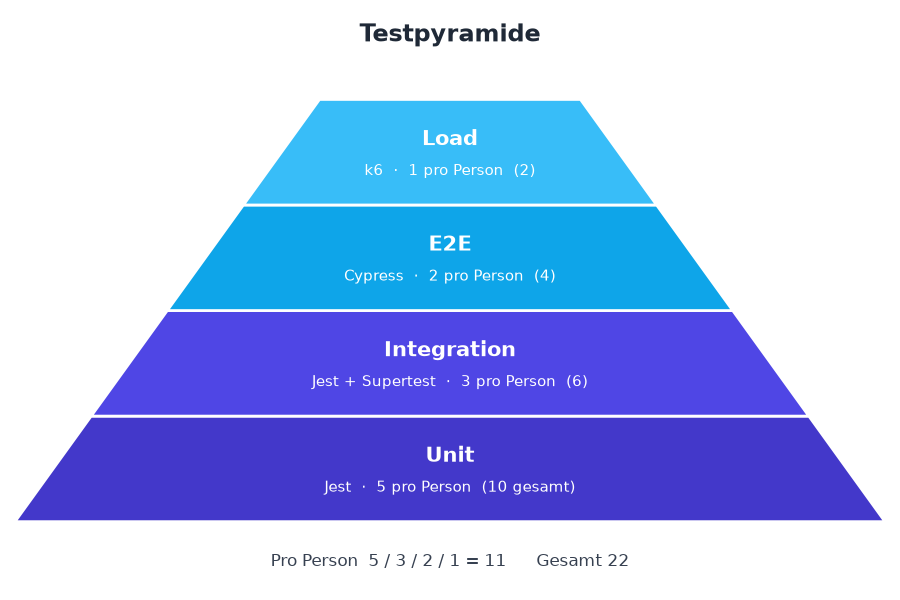
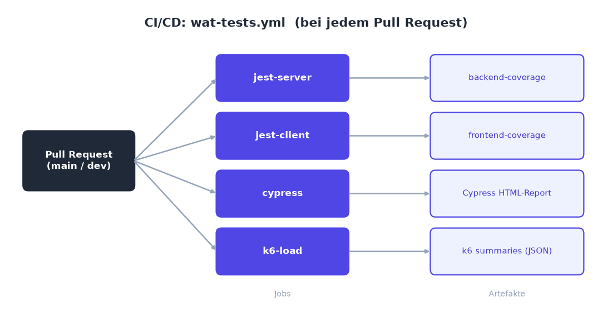
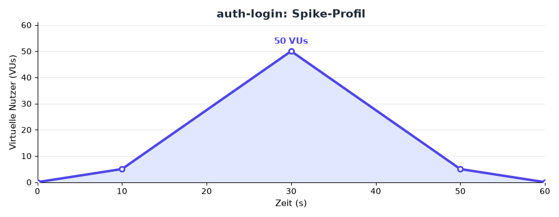
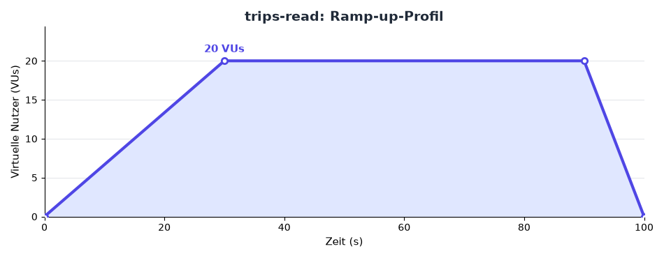
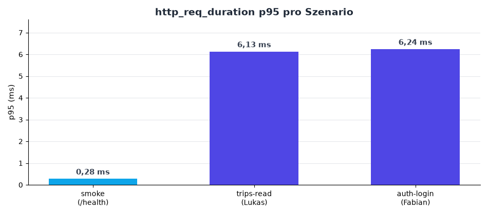
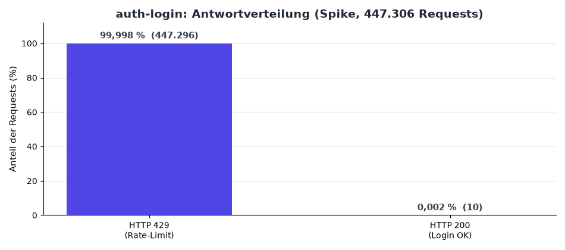
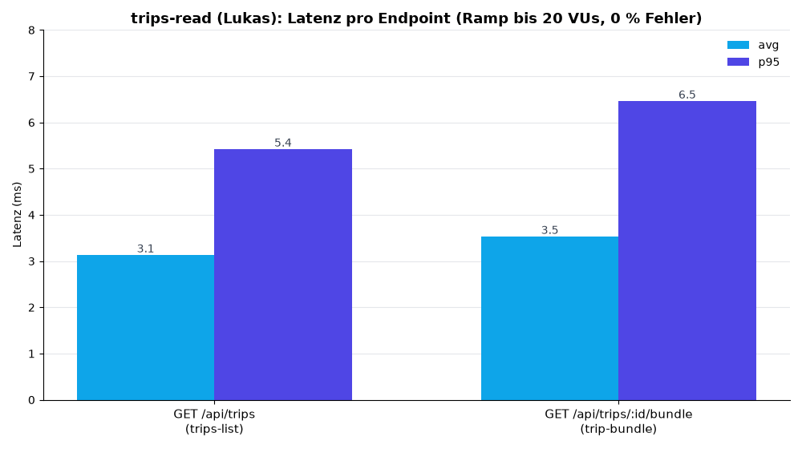

# Projektarbeit Webanwendungstesting: TREK

**Team:** Lukas Bandalo, Fabian Luttenberger
**KI-Werkzeuge:** Claude Code (Anthropic, Claude Sonnet 4.6), siehe Abschnitt 7.
**Fork:** `github.com/luttfab77/TREK-wat4` (Upstream: `github.com/mauriceboe/TREK`)

---

## 1. Die Webanwendung (kurz)

**TREK** ist ein self-hosted, echtzeit-kollaborativer Reiseplaner. Nutzer planen
Reisen mit Karten, Tagesplänen, Budget und Kostenteilung, Packlisten, Reise-Journal,
Urlaubsplaner (Vacay) und KI-Integration (MCP).

|              |                                                                                       |
|--------------|---------------------------------------------------------------------------------------|
| Backend      | NestJS 11 + Express, SQLite (better-sqlite3), WebSocket, JWT/OAuth/OIDC/Passkeys      |
| Frontend     | React 19 + Vite, Zustand, Leaflet/Mapbox, PWA                                         |
| Struktur     | npm-Monorepo mit drei Workspaces: `shared/` (Zod-Schemas/Typen), `server/`, `client/` |
| Auslieferung | Docker (Single-Image), Helm-Charts                                                    |

Wir haben TREK gewählt, weil es eine reale, nicht-triviale Anwendung mit klarer
Geschäftslogik ist. Settlement-Berechnung, Tagesgenerierung, Authentifizierung und
Mehrwährungs-Budget bieten genug für fachliche Tests.

---

## 2. Testkonzept und Strategie

Der Upstream bringt bereits eine umfangreiche Testsuite mit (rund 390 Dateien) auf
Basis von Vitest (Unit/Integration) und Playwright (E2E), inklusive eines
80%-Coverage-Gates auf der NestJS-Schicht.

Die Angabe erlaubt bei bereits getesteten Anwendungen zwei Wege. Entweder man misst die
Coverage und ergänzt ungetesteten Code, oder man setzt die eigenen Tests mit einem
anderen Framework um. Wir haben uns bewusst für den zweiten Weg entschieden und dabei
gezielt Kernfunktionen der Anwendung getestet. Konkret nutzen wir:

- Unit und Integration mit **Jest** (statt Vitest), auf dem Server mit `@swc/jest` und **Supertest**
- E2E-Tests mit **Cypress** (statt Playwright)
- Last-Tests mit **Grafana k6**, wofür es im Repo zuvor gar kein Tool gab

So setzen wir andere Werkzeuge ein als der Upstream und grenzen unseren Beitrag sauber
ab. Unsere Tests liegen in eigenen Ordnern (`tests-wat/`, `cypress/`, `loadtests/`) und
laufen unabhängig von der bestehenden Suite (siehe Abschnitt 3.5).

Die Anwendung haben wir entlang ihrer Kern-Use-Cases nach Domänen aufgeteilt. Lukas hat
Budget und Settlement, Trips und Tagesgenerierung, Places sowie Reservations übernommen.
Fabian hat Auth und Account, Währung und Distanz, Vacay sowie den Journey-Lifecycle
bearbeitet.

---

## 3. Test-Setup (ausführlich)

### 3.1 Frameworks und Begründung

| Ebene              | Werkzeug                                    | Warum                                                                                                                                 |
|--------------------|---------------------------------------------|---------------------------------------------------------------------------------------------------------------------------------------|
| Unit/Integration   | Jest 30 + `@swc/jest`                       | Anderer Runner als Vitest. Die SWC-Transform liefert die NestJS-Decorator-Metadaten, damit Dependency Injection im Test funktioniert. |
| Integration (HTTP) | Supertest                                   | Treibt die echte NestJS-App ohne echten Netzwerk-Port.                                                                                |
| E2E                | Cypress 15 + `cypress-mochawesome-reporter` | Anderes Browser-E2E-Tool als Playwright, dazu ein HTML-Report als Artefakt.                                                           |
| Load               | Grafana k6 + InfluxDB/Grafana               | In JavaScript skriptbar, gute Metriken (p95/p99, RPS), live in Grafana sichtbar.                                                      |
| Client-Unit        | Jest + jsdom                                | Reine Logik-Tests ohne Vite oder Vitest.                                                                                              |

### 3.2 Mengengerüst und Testpyramide

Pro Person ist die Pyramide mit 5 Unit, 3 Integration, 2 E2E und 1 Load (also 11)
erfüllt. Viele Dateien enthalten mehrere Testfälle, die tatsächliche Fallzahl liegt also
höher.



#### Lukas Bandalo (Budget / Trips / Places / Reservations)

| #       | Ebene       | Datei                                    | Was und warum getestet                                                                                                                           |
|---------|-------------|------------------------------------------|--------------------------------------------------------------------------------------------------------------------------------------------------|
| 1       | Unit        | `budget-settlement.test.ts`              | `calculateSettlement`, der Schuldenausgleich. Einzel- und Mehrzahler, 3-Wege-Rundung, Settle-up, Mehrwährung. Kernalgorithmus der Kostenteilung. |
| 2       | Unit        | `budget-summary.test.ts`                 | `getPerPersonSummary` und `toggleMemberPaid`, also Pro-Person-Aufstellung und bezahlte Anteile.                                                  |
| 3       | Unit        | `reservation.test.ts`                    | `day_id`-Ableitung bei `createReservation` und `deleteReservation`. Tag-Zuordnung, Hotel-Sonderfall, Trip-Bindung.                               |
| 4       | Unit        | `trip-generatedays.test.ts`              | `generateDays`. Tage aus einem Datumsbereich, 1-Tages-Trip, `maxDays`-Deckel, offenen Plan nachträglich datieren.                                |
| 5       | Unit        | `formatters.test.ts` (Client)            | Geld- und Orts-Formatierung sowie `dayTotalCost`, also währungs- und locale-korrekte Anzeige.                                                    |
| 6 bis 8 | Integration | `budget-api`, `places-api`, `trips-api`  | CRUD plus Settlement plus Permission-Pfade (404 für Nicht-Member, 403 ohne `place_edit`), Trip-zu-Tagesgenerierung, Nutzer-Isolation.            |
| 9, 10   | E2E         | `trip-create.cy.ts`, `planner-add.cy.ts` | Trip vom Dashboard anlegen (übersteht Reload, Planner-Map mountet) und einen Place im Planner hinzufügen (bleibt nach Reload).                   |
| 11      | Load        | `trips-read.js`                          | Read-Last (Ramp-up) auf `GET /api/trips` und `/:id/bundle`.                                                                                      |

#### Fabian Luttenberger (Auth / Währung und Distanz / Vacay / Journey)

| #       | Ebene       | Datei                                      | Was und warum getestet                                                                                                                                    |
|---------|-------------|--------------------------------------------|-----------------------------------------------------------------------------------------------------------------------------------------------------------|
| 1       | Unit        | `exchangeRateService.test.ts`              | `getRates` (Caching, TTL, graceful Degradation bei Fetch-Fehler) und `convertWithRates`. Grundlage der Mehrwährungs-Budgets.                              |
| 2       | Unit        | `passwordPolicy.test.ts`                   | `validatePassword`. Längen-, Komplexitäts- und Common-Password-Regeln, parametrisiert über `it.each`. Security-Kernfunktion.                              |
| 3       | Unit        | `distanceService.test.ts`                  | `getFlightDistanceKm`, die Haversine-Summe über Flug-Endpunkte, ignoriert stornierte Flüge.                                                               |
| 4       | Unit        | `vacayService.test.ts`                     | Urlaubstage-Statistik mit verbrauchten und verbleibenden Tagen sowie Toggle-Verhalten.                                                                    |
| 5       | Unit        | `journeyLifecycle.test.ts` (Client)        | `computeJourneyLifecycle`, also der Status live, upcoming, completed, draft oder archived. Parametrisiert mit deterministischer Zeit.                     |
| 6 bis 8 | Integration | `auth.test.ts` (2) und `vacay.test.ts` (1) | Login setzt das Session-Cookie und schaltet `GET /api/auth/me` frei, falsches Passwort führt zu 401, ein Vacay-Toggle wird im Stats-Endpoint reflektiert. |
| 9, 10   | E2E         | `login.flow.cy.ts`, `dashboard.cy.ts`      | Falsch-Login zeigt einen Fehler und bleibt auf `/login`, eine eingeloggte Session erreicht das Dashboard (inklusive erzwungenem Erst-Passwortwechsel).    |
| 11      | Load        | `auth-login.js`                            | Login-Spike auf `POST /api/auth/login` (bcrypt plus Rate-Limiter).                                                                                        |

Dazu kommen drei geteilte Infrastruktur-Smokes, die nicht ins Mengengerüst zählen:
`harness.test.ts` (Server-Boot und Guard), `login.public.cy.ts` (App bootet, Formular
rendert) und `smoke.js` (k6 gegen `/health`).

### 3.3 Test-Ausführung

```bash
nvm use 24 # Projekt zielt auf Node 24

# Unit + Integration (Jest)
cd server && npm run test:jest # + :unit / :integration / :cov
cd client && npm run test:jest # + :cov

# E2E (Cypress), bootet Backend (:3001) und Vite (:5173) selbst
cd client && npm run e2e:cy # erzeugt cypress/reports/index.html

# Load (k6), Backend separat hochfahren: cd client && node e2e/server-launch.mjs
cd loadtests && k6 run smoke.js && k6 run trips-read.js && k6 run auth-login.js
# Live-Visualisierung: docker compose -f loadtests/docker-compose.yml up -d
```

### 3.4 CI/CD-Pipeline

Wir haben einen eigenen GitHub-Actions-Workflow `.github/workflows/wat-tests.yml`, getrennt
von der Upstream-`test.yml`. Er läuft bei Pull Requests auf `main` oder `dev`, sobald sich
etwas an `server/`, `client/`, `shared/` oder `loadtests/` ändert.



Jeder Job macht `npm ci`, zieht das fehlende `@swc/core`-Linux-Binary nach,
baut `shared` und führt dann die Tests aus. Am Ende lädt jeder Job ein Artefakt hoch: 
Jest-Coverage, Cypress-HTML-Report und k6-Summaries. Im k6-Job ist die Reihenfolge 
`smoke`, `trips-read`, `auth-login` bewusst gewählt, weil der auth-login-Spike das 
Per-IP-Login-Limit ausreizt. Liefe `trips-read` danach, bekäme sein Setup-Login ein 429.

### 3.5 Test-Isolation

**Runner-Isolation.** Unsere Tests liegen in `tests-wat/` beziehungsweise `cypress/`. Jests
`roots` und `testMatch` sind strikt darauf begrenzt, deshalb fasst Jest keine der rund 390
Vitest-Dateien des Upstreams an. Beide Suiten laufen unabhängig voneinander.

**DB-Isolation.** Jede Testdatei bekommt eine eigene In-Memory-SQLite über
`tests-wat/helpers/db-singleton`. Die Module für DB, Config und WebSocket werden per
`jest.mock` ersetzt, und `createTestApp()` bootet eine frische NestApp. Pro Test legen wir
eigene Entitäten an, etwa einen eindeutigen Nutzer.

**Modul- und State-Isolation.** Gegen den modulinternen Rate-Cache nutzen wir
`jest.resetModules()`, dazu `jest.spyOn` mit `restoreAllMocks` und Fake-Timer für
deterministische Zeit.

**E2E-Isolation.** Cypress fährt über `e2e/server-launch.mjs` ein wegwerfbares, frisch
geseedetes SQLite-Backend hoch und verwendet nie einen laufenden Dev-Server. Mit
`cy.session({ cacheAcrossSpecs: true })` läuft der einmalige Erst-Passwortwechsel nur
einmal pro Lauf.

**Load-Isolation.** k6 läuft gegen die ephemere Seed-Instanz (`BASE_URL`, Default `:3001`)
und nie gegen Demo oder Produktion.

---

## 4. Load-Tests

Es gibt drei k6-Skripte in `loadtests/` mit gemeinsamen Profilen und Schwellen in
`lib/options.js`. Jeder Lauf schreibt sein Ergebnis nach `results/<name>.summary.json`
(über `handleSummary`). Live lässt sich der Lauf über `docker compose` visualisieren
(k6 nach InfluxDB nach Grafana, Dashboard "k6 Load Test").

### 4.1 Art und Zweck

| Skript          | Owner   | Art                         | Ziel-Endpoint                      | Zweck                                                                                    |
|-----------------|---------|-----------------------------|------------------------------------|------------------------------------------------------------------------------------------|
| `smoke.js`      | geteilt | Smoke (5 VUs, 10 s)         | `GET /api/_nest/health`            | Toolchain- und Erreichbarkeits-Check als Baseline.                                       |
| `trips-read.js` | Lukas   | Ramp-up (bis 20 VUs, 100 s) | `GET /api/trips` und `/:id/bundle` | Read-Last, viele Nutzer browsen ihre Trips. Misst die Lese-Latenz unter steigender Last. |
| `auth-login.js` | Fabian  | Spike (bis 50 VUs, 60 s)    | `POST /api/auth/login`             | Stresstest des teuren Auth-Pfads (bcrypt) und des Per-IP-Rate-Limiters.                  |

Lastprofile als Verlauf der virtuellen Nutzer über die Zeit:





### 4.2 Ergebnisse

Die Läufe entstanden lokal (macOS, Node 24, Single-Process-Backend gegen In-Memory-SQLite).

| Metrik            |   smoke | trips-read (Lukas) | auth-login (Fabian) |
|-------------------|--------:|-------------------:|--------------------:|
| Requests gesamt   | 251.220 |              3.208 |             447.306 |
| Durchsatz (req/s) |  25.121 |                 32 |               7.455 |
| Latenz avg        | 0,18 ms |            3,44 ms |             2,56 ms |
| Latenz p95        | 0,28 ms |            6,13 ms |             6,24 ms |
| Latenz max        |   12 ms |             360 ms |              586 ms |
| `http_req_failed` | 0,000 % |            0,000 % |             0,000 % |
| Schwellen erfüllt |      ja |                 ja |                  ja |



Bei `auth-login` fällt auf, dass von 447.306 Login-Requests rund 100 Prozent mit HTTP 429
beantwortet wurden, also vom Rate-Limit. Die Schwellen behandeln 200 und 429 als
erwartet (`http.setResponseCallback(http.expectedStatuses(200, 429))`), daher liegt
`http_req_failed` bei 0 Prozent.



Bei `trips-read` ist eine Antwortverteilung wenig aussagekräftig, da nahezu 100 Prozent der
Requests mit HTTP 200 beantwortet werden. Aufschlussreicher ist dort die Latenz je Endpoint.
Beide getaggten Routen bleiben unter Last schnell.



### 4.3 Analyse

Beim Spike auf `auth-login` greift der Per-IP-Rate-Limiter (10 Logins pro Fenster) und
wirft fast den gesamten Traffic mit schnellen 429 ab, noch bevor der teure
bcrypt-Vergleich läuft. Das Ergebnis ist eine sehr niedrige p95 von 6 ms trotz 50 VUs und
7.455 req/s, und es gibt keine 5xx. Der Limiter erfüllt damit genau seinen Zweck. Login-
Flooding wird abgewehrt und der CPU-intensive Hash-Pfad bleibt geschützt. Der eigentliche
Engpass ist also der Limiter, und das ist gewollt.

Beim Ramp auf `trips-read` skalieren die authentifizierten Reads bis 20 VUs sauber, mit
einer p95 von rund 6 ms und 0 Prozent Fehlern. Der niedrige Durchsatz von 32 req/s ist
Absicht, denn jede Iteration hat ein `sleep(1)` als Think Time und bildet damit reales
Browsing ab statt Maximaldurchsatz.

TREK nutzt better-sqlite3, also einen Single-Writer. Unsere Reads bleiben schnell, weil
sie nicht serialisiert werden. Ein write-lastiger Test würde hier ein anderes Bild
zeigen, war aber bewusst nicht Teil unserer Read- und Auth-Szenarien.

Die Absolutwerte hängen von Hardware und Konfiguration ab, da wir lokal gegen ein
Single-Process-Backend gemessen haben. Aussagekräftig ist das relative Verhalten und die
Erfüllung der definierten Schwellen.

---

## 5. Erkenntnisse

Ein anderes Framework bedeutet auch einen anderen Resolver. Jest brauchte ein paar
gezielte Anpassungen, die unter Vitest und SWC im Upstream einfach laufen: ein
`.js`-zu-`.ts`-Mapping, ESM-only-Abhängigkeiten über `transformIgnorePatterns` und einen
`jsdom`-Stub für `isomorphic-dompurify`.

Für reproduzierbare Tests haben wir auf Determinismus geachtet. Fake-Timer beim
Journey-Lifecycle, `jest.resetModules` gegen den Rate-Cache und feste Seeds sorgen dafür,
dass Läufe wiederholbar sind.

Bei den E2E-Tests mussten der erzwungene Erst-Passwortwechsel und eine First-Run-Notice in
`cy.login` deterministisch behandelt werden. `cacheAcrossSpecs` führt den Login-Setup nur
einmal pro Lauf aus.

---

## 6. Reproduzierbarkeit

Das Projekt zielt auf Node 24 (`nvm use 24`). k6 installiert man über `brew install k6`
oder die Releases (inklusive Windows ARM). Lokal sind alle Suiten grün: Jest auf Server
und Client, Cypress mit 6 von 6 Specs und k6 mit 3 von 3 Skripten. In der CI laufen
dieselben Suiten plus der Artefakt-Upload.

---

## 7. Mitwirkende und KI-Werkzeuge

**Personen**

Lukas Bandalo hat die Domänen Budget und Settlement, Trips und Tagesgenerierung, 
Places sowie Reservations bearbeitet (Unit, Integration, E2E und Load wie in Abschnitt 3.2).

Fabian Luttenberger hat die Domänen Auth und Account, Währung und Distanz, Vacay sowie
Journey bearbeitet (Unit, Integration, E2E und Load wie in Abschnitt 3.2).

**Eingesetzte KI-Werkzeuge**

Claude Code (Anthropic, Claude Sonnet 4.6) kam beim Test-Setup zum Einsatz, also bei der
Konfiguration der Test-Frameworks Jest, Cypress und k6, sowie bei dieser Dokumentation.
Die Tests selbst und die CI-Pipeline haben wir eigenständig erstellt. Alle Ergebnisse
wurden lokal ausgeführt und verifiziert und auch mit grünen Pipeline Runs bestätigt.
